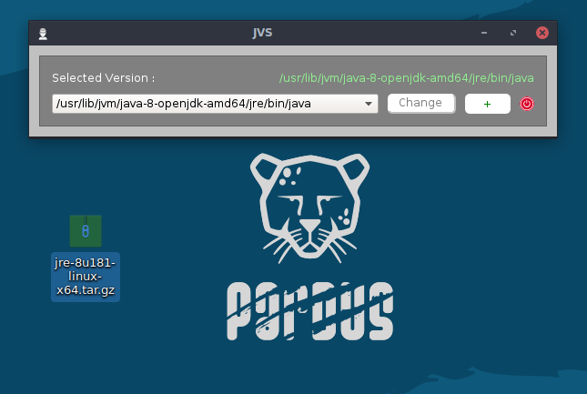
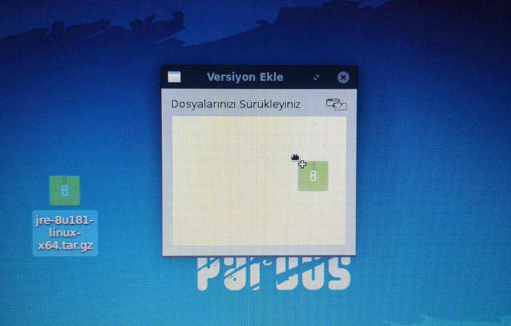
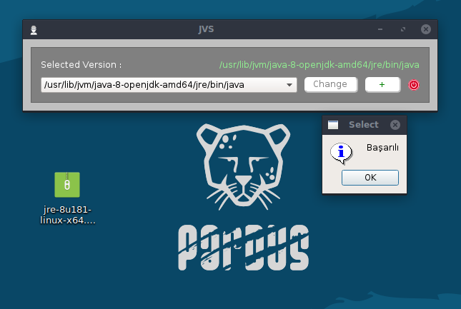
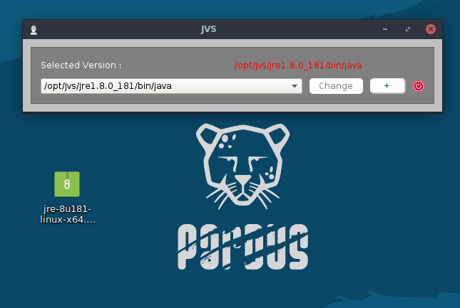
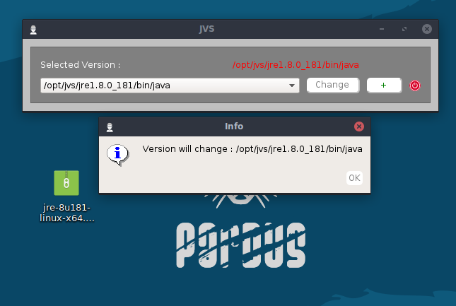
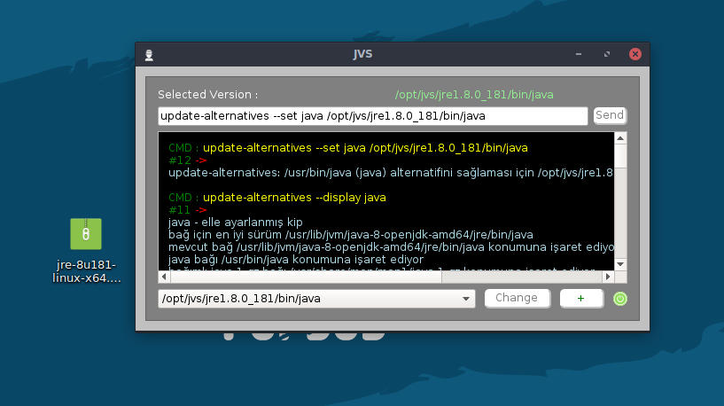

# Java Version Selector [JVS]

**Version	:**  1.0 		 
**License  	:**  GPL 		 
**Contributors  :**  Burak Büyükyüksel	 

## Nedir?

Var olan Java versiyonlarını listeleyerek, istenilen versiyonun seçilebilmesini sağlar.

## İmkan Sağlar;

*	<i> "tar.gz" uzantılı java dosyasını sürükle-bırak yöntemi ile sisteme yükleme </i>
*	<i> Güncel olan Java versiyonunu görüntüleyebilme </i>
*	<i> Arka planda yapılan işlemlerinin log çıktılarını görüntüleyebilme </i>
*	<i> Basitleştirilmiş terminal arayüzü ile kabuğa komut yollayabilme </i>

### Not
* 	<i> Programın sağlıklı çalışabilmesi için "root" yetkili çalıştırılmalıdır </i>
* 	<i> Basitleştirilmiş tasarımı ile kabuğa komut geçirip, standart çıktılarını gözlemleyebilme imkanı tanıdığından, projeye bağlı olarak iskelet yapıyı oluşturulabilir </i>

<table>
	<tr>
		<th colspan=3> <b> Uygulama İçerisinden </b> </th>	
	</tr>
	<tr>
		<td> </td>
		<td> </td>
		<td> </td>
	</tr>
	<tr>
		<td> </td>
		<td> </td>
		<td> </td>
	</tr>
</table>

## Changelog

### 1.0
* Released : September 18, 2018

Initial release